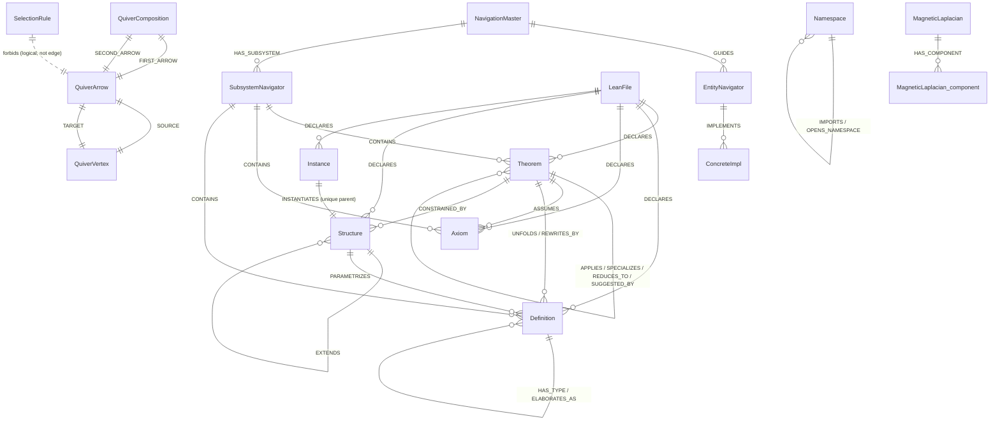

# Neo4j Pipeline for OmegaTheory V2 — V3-for-Lean Adaptation

## TL;DR

Three Neo4j namespaces power OmegaTheory V2's graph-augmented proof assistant:

1. `OmegaTheoryV2` — the physics formalization DATA layer (Theorem / Definition / Axiom / LeanFile / Structure / Instance / Namespace + ConcreteImpl / EntityNavigator / NavigationMaster).
2. `LeanAlgebra` — the V3 SCHEMA scaffold: 6 QuiverVertex + 15 QuiverArrow + 12 QuiverComposition + 7 SelectionRule + 1 MagneticLaplacian (6x6, Hermitian, g=1/4).
3. `Mathlib` — the Mathlib 4 v4.29.0 corpus (49,985 Theorem + 3,183 LeanFile nodes ingested so far; target ~500K declarations) linked to OmegaTheoryV2 via IMPORTS.

Together they form a typed property graph on which a Magnetic Laplacian admits FastRP projections (m=64 per relation, seed=42) to detect subsystems via a Grothendieck two-lens consensus (K-means + Leiden + co-association + Berry-phase boundary). This is the first coupling of Magnetic-Laplacian + Leiden-community-detection to a theorem-prover corpus; paper target NeurIPS 2026 / ICLR 2027.

## Index

1. Overview
2. Quick start
3. Namespace: OmegaTheoryV2
4. Namespace: LeanAlgebra
5. Namespace: Mathlib
6. Relationship types
7. Vector indexes
8. Common queries (10 recipes)
9. Pipeline order (10-step canonical load sequence)
10. Maintenance
11. Troubleshooting
12. ERD (Mermaid)

---

## 1. Overview

This directory holds the Cypher + Python that wires the V3 quiver-algebra framework onto the OmegaTheory V2 Lean 4 corpus. Three namespaces separate concerns:

| Namespace | Role | What lives there |
|---|---|---|
| `OmegaTheoryV2` | Data | Concrete Lean declarations with full content (signature, proof_body, docstring, source_span, embedding_lean) + 3-level NavigationMaster hierarchy |
| `LeanAlgebra` | Schema (algebraic law) | Vertex types, typed arrows, composition table, forbidden-block selection rules, Magnetic Laplacian spec |
| `Mathlib` | Corpus | Full Mathlib 4 v4.29.0, same shape as OmegaTheoryV2, linked via IMPORTS |

The separation matters: updating the schema (LeanAlgebra) never touches data, and ingesting new Lean files (OmegaTheoryV2 / Mathlib) never rewrites the algebraic law.

## 2. Quick start

### Connect

```bash
docker exec -it math cypher-shell -u neo4j -p omegatheory2026
```

### Health check

```cypher
// Expect: OmegaTheoryV2 = 1 NavigationMaster + 18 EntityNavigators + 800 Theorem + 401 Definition + 9 Axiom + 176 LeanFile + 144 ConcreteImpl + 146 Structure + 26 Instance + 86 Namespace
MATCH (n) WHERE n.namespace = 'OmegaTheoryV2'
RETURN labels(n)[0] AS label, count(*) AS cnt
ORDER BY cnt DESC;
```

### Load order (canonical)

```bash
cd /mnt/c/Users/Norbert/IdeaProjects/chaos-shield/PhysicsPapers/LeanFormalizationV2

# Phase 0: bootstrap + schema
docker exec -i math cypher-shell -u neo4j -p omegatheory2026 < .neo4j/bootstrap_omegatheory.cypher
docker exec -i math cypher-shell -u neo4j -p omegatheory2026 < .neo4j/lean_algebra_ontology.cypher
docker exec -i math cypher-shell -u neo4j -p omegatheory2026 < .neo4j/lean_algebra_arrows.cypher
docker exec -i math cypher-shell -u neo4j -p omegatheory2026 < .neo4j/catalogue_declarations_extension.cypher

# Phase B: declaration ingest
python .neo4j/catalogue_scan.py                 # emits Declaration / Theorem / Axiom rows
python .neo4j/catalogue_load.py                 # loads them (delegates embedding to patch)
python .neo4j/extractors/lean_arrow_extractor.py

# Phase 1: laplacian + projections + clustering + enrichment
docker exec -i math cypher-shell -u neo4j -p omegatheory2026 < .neo4j/lean_magnetic_laplacian.cypher
docker exec -i math cypher-shell -u neo4j -p omegatheory2026 < .neo4j/fastrp_config.cypher
docker exec -i math cypher-shell -u neo4j -p omegatheory2026 < .neo4j/grothendieck_lean.cypher
docker exec -i math cypher-shell -u neo4j -p omegatheory2026 < .neo4j/erdos_enrich.cypher
```

## 3. Namespace: `OmegaTheoryV2`

Live counts (verified 2026-04-18):

| Label | Count | Role |
|---|---:|---|
| `Theorem` | 800 | Lean `theorem` / `lemma` / `example` declarations |
| `Definition` | 401 | `def` / `abbrev` / `notation` |
| `LeanFile` | 176 | physical `.lean` files (35 also carry `:Namespace` label) |
| `Structure` | 146 | `structure` / `class` / `inductive` |
| `ConcreteImpl` | 144 | NavigationMaster 3rd-level leaves |
| `Namespace` | 86 | Lean `namespace` / `section` scopes |
| `Instance` | 26 | typeclass `instance` witnesses |
| `EntityNavigator` | 18 | NavigationMaster 2nd-level category pivots |
| `Axiom` | 9 | `axiom` declarations (physical constants + `Real.pi_transcendental`) |
| `NavigationMaster` | 1 | root node |

Mixed-label nodes exist: e.g. `["ConcreteImpl","TODO"]` (33), `["ConcreteImpl","Prediction"]` (4), `["LeanFile","Namespace"]` (35), `["Theorem"]`-only vs `["ConcreteImpl","Theorem"]`.

### Key node properties

#### `Theorem` (live keys sampled)

| Key | Type | Meaning |
|---|---|---|
| `namespace` | str | always `'OmegaTheoryV2'` |
| `name` | str | fully-qualified Lean name |
| `ai_description` | str | human-readable gloss |
| `file` | str | relative path in `LeanFormalizationV2/OmegaTheory/` |
| `depth_from_axiom` | int | minimum-path depth from any Axiom along `APPLIES`+`ASSUMES` |
| `is_flagship` | bool | headline results (e.g. `grand_qm_emergence`) |
| `declaration_type` | str | `theorem` / `lemma` / `example` |
| `signature` | str | Lean type ascription (populated by Naos backfill) |
| `docstring` | str | leading `/--` block (populated by Naos) |
| `proof_body` | str | tactic script between `by` and next top-level (populated by Naos) |
| `source_span` | str | `file:L1-L2` |
| `content_populated_at` | datetime | Naos timestamp |
| `hypothesis_pattern` | str | canonicalized LHS-of-colon (for premise selection) |
| `embedding_lean` | VECTOR<FLOAT32>(1472) | LeanDojo ByT5-small encoder output (cosine) |

#### `LeanFile`

| Key | Type | Meaning |
|---|---|---|
| `namespace` | str | `'OmegaTheoryV2'` |
| `path` | str | repo-relative path |
| `role` | str | `foundation` / `bridge` / `capstone` / `predictions` / ... |
| `declarations_count` | int | how many Theorem/Definition/Axiom/Structure/Instance belong to this file |

#### `ConcreteImpl`

| Key | Type | Meaning |
|---|---|---|
| `path` | str | file path or subsystem id |
| `behavioral_category` | str | one of 6 V3 categories (Controller/Configuration/Security/Implementation/Diagnostics/Lifecycle) |
| `status` | str | `PLANNED` / `IMPLEMENTED` / `DEPRECATED` |
| `theorem_count` / `def_count` / `axiom_count` / `import_count` | int | counters |

#### `NavigationMaster` (the root)

```cypher
MATCH (nav:NavigationMaster {namespace: 'OmegaTheoryV2'})
RETURN nav.name, nav.build_jobs, nav.sorry_count, nav.axiom_count,
       nav.theorem_count, nav.file_count, nav.hpw_axiom_deleted,
       nav.matter_sector_status, nav.ebhpw_status;
// theorem_count = 1900 (includes nested namespace decls not yet split into per-Theorem nodes)
// build_jobs = 3536, sorry_count = 0, axiom_count = 8
```

## 4. Namespace: `LeanAlgebra`

Live counts (verified 2026-04-18):

| Label | Count | Role |
|---|---:|---|
| `QuiverVertex` | 6 | Lean entity types (pure schema) |
| `QuiverArrow` | 15 | typed relationship generators |
| `QuiverComposition` | 12 | canonical depth-2 chains |
| `SelectionRule` | 7 | forbidden-block laws |
| `MagneticLaplacian` | 1 | 6x6 Hermitian spec + matrix cells |
| `MagneticLaplacian_component` | 15 | per-relation rank-2 decomposition |

### `QuiverVertex` (6 entity types)

| Name | Height | V3 analogue | Role | Lean tokens |
|---|---:|---|---|---|
| `Axiom` | 3 | Actor (A) | pure_source | `axiom`, `constant` |
| `Definition` | 2 | Resource (R) | semantic_data | `def`, `abbrev`, `notation`, `variable` |
| `Structure` | 2 | Rule (Ru) | framework | `structure`, `class`, `inductive` |
| `Theorem` | 1 | Process (P) | active_hub | `theorem`, `lemma`, `example`, `proposition` |
| `Instance` | 1 | Event (E) | pure_sink | `instance`, `@[instance]` |
| `Namespace` | 0 | Context (C) | environmental | `namespace`, `section`, `end`, `import` |

### `QuiverArrow` (15 typed arrows)

| Category | Arrows (src -> tgt) |
|---|---|
| I. Structural (4) | `IMPORTS` (Ns->Ns), `OPENS_NAMESPACE` (Ns->Ns), `EXTENDS` (Struct->Struct), `INSTANTIATES` (Inst->Struct) |
| II. Dependency (5) | `ASSUMES` (Thm->Ax), `APPLIES` (Thm->Thm), `UNFOLDS` (Thm->Def), `SPECIALIZES` (Thm->Thm), `REWRITES_BY` (Thm->Def) |
| III. Type-theoretic (3) | `HAS_TYPE` (Def->Def), `CONSTRAINED_BY` (Thm->Struct), `PARAMETRIZES` (Struct->Def) |
| IV. Computational (3) | `REDUCES_TO` (Thm->Thm), `ELABORATES_AS` (Def->Def), `SUGGESTED_BY` (Thm->Thm) |

Each `QuiverArrow` carries `lean_surface` (example syntax), `cypher_edge_name` (literal label on the declaration graph), `category_label`, and (where applicable) `bidirectional_pair` — e.g. `UNFOLDS <-> REWRITES_BY`.

### `SelectionRule` (7 HARD_BLOCK laws)

| Rank | Name | Forbids |
|---:|---|---|
| 1 | `axiom_is_pure_source` | ANY -> Axiom |
| 2 | `namespace_is_container_only` | Namespace -APPLIES-> Thm, Namespace -ASSUMES-> Ax |
| 3 | `instance_unique_parent` | Instance -INSTANTIATES-> S1 AND -> S2 (S1 != S2) |
| 4 | `acyclic_extends_dag` | cycles in EXTENDS subgraph |
| 5 | `reverse_causality_axiom_assumes` | Axiom -ASSUMES-> Theorem |
| 6 | `sink_instance_no_applies` | Instance -APPLIES-> Theorem |
| 7 | `namespace_not_opening_theorem` | Namespace -OPENS_NAMESPACE-> non-Namespace |

### `MagneticLaplacian`

6x6 Hermitian, alphabetical row/col ordering `[Axiom, Definition, Instance, Namespace, Structure, Theorem]`, phase formula `T^(g)_XY = exp(i * 2*pi * g * D_XY)` with `g=1/4`. Stored as two flat 36-element row-major lists (`real_part`, `imag_part`); cell `(i,j)` at index `6*i+j`. The 15 `MagneticLaplacian_component` nodes give the per-relation rank-2 decomposition.

Hermiticity contract (checked in `lean_magnetic_laplacian.cypher` §end):

```
imag[i][j] == -imag[j][i]   for all i,j
imag[i][i] == 0             for all i
```

## 5. Namespace: `Mathlib`

Live counts (verified 2026-04-18, ingestion ongoing):

| Label | Count | Target |
|---|---:|---|
| `Theorem` | 49,985 | ~500K |
| `LeanFile` | 3,183 | 7,871 |

Each node has the same key shape as OmegaTheoryV2 (`signature`, `proof_body`, `docstring`, `source_span`, `embedding_lean` etc.). Purpose: retrieval expansion for OmegaTheoryV2 proofs + MiniF2F-style benchmarking. Mathlib nodes link to OmegaTheoryV2 via `IMPORTS` edges extracted by `lean_arrow_extractor.py`.

## 6. Relationship types

### Typed arrows (the 15 QuiverArrow realizations)

Realized on Declaration-level nodes (`Theorem`, `Definition`, `Axiom`, `Structure`, `Instance`, `Namespace`) by the Phobos-Iota extractor:

`APPLIES` | `ASSUMES` | `UNFOLDS` | `SPECIALIZES` | `REWRITES_BY` | `HAS_TYPE` | `CONSTRAINED_BY` | `PARAMETRIZES` | `REDUCES_TO` | `ELABORATES_AS` | `SUGGESTED_BY` | `IMPORTS` | `OPENS_NAMESPACE` | `EXTENDS` | `INSTANTIATES`

### Structural edges (3-level hierarchy)

| Edge | Source -> Target | Meaning |
|---|---|---|
| `GUIDES` | NavigationMaster -> EntityNavigator | level 1 to level 2 |
| `IMPLEMENTS` | EntityNavigator -> ConcreteImpl | level 2 to level 3 |
| `HAS_SUBSYSTEM` | NavigationMaster -> SubsystemNavigator | Grothendieck output |
| `CONTAINS` | SubsystemNavigator -> (Theorem/Axiom/Definition/...) | subsystem membership |
| `DECLARES` | LeanFile -> (Theorem/Def/Ax/Struct/Inst) | file ownership of a declaration |

### LeanAlgebra schema wiring

| Edge | Source -> Target | Count |
|---|---|---:|
| `SOURCE` | QuiverArrow -> QuiverVertex | 15 |
| `TARGET` | QuiverArrow -> QuiverVertex | 15 |
| `FIRST_ARROW` | QuiverComposition -> QuiverArrow | 12 |
| `SECOND_ARROW` | QuiverComposition -> QuiverArrow | 12 |
| `HAS_COMPONENT` | MagneticLaplacian -> MagneticLaplacian_component | 15 |

Plus semantic auxiliaries from the Omega-Content research layer (sampled via `db.relationshipTypes()`): `CITES`, `PREREQUISITE_FOR`, `VERIFIES`, `REFUTES`, `COMPANION_TO`, `REFINES_TO`, `CLOSES_EMPIRICALLY`, `DEPENDS_ON`, `USES_FACT`, `USES_THEOREM`, `USES_AXIOM` — see `db.relationshipTypes()` for the full 90-element list.

## 7. Vector indexes

Three VECTOR indexes, dim=1472, cosine similarity, on `embedding_lean`:

| Index name | Label | Property |
|---|---|---|
| `lean_retriever_embedding_theorem` | `Theorem` | `embedding_lean` |
| `lean_retriever_embedding_axiom` | `Axiom` | `embedding_lean` |
| `lean_retriever_embedding_declaration` | `Declaration` | `embedding_lean` |

Embedder: `kaiyuy/leandojo-lean4-retriever-byt5-small` (ByT5-small, 82M params, open weights, d_model=1472). See `catalogue_declarations_extension.cypher:26-36` for rationale. To swap the encoder, `DROP` + re-`CREATE` these three indexes with the new dimension.

## 8. Common queries

### (a) find theorem by name

```cypher
MATCH (t:Theorem {namespace: 'OmegaTheoryV2', name: $name})
RETURN t.name, t.signature, t.docstring, t.file, t.source_span;
```

### (b) kNN retrieve 10 most similar theorems to a query embedding

```cypher
CALL db.index.vector.queryNodes(
  'lean_retriever_embedding_theorem',
  10,
  $queryVector    // 1472-d list<float>
) YIELD node, score
RETURN node.name AS name, node.file AS file, score
ORDER BY score DESC;
```

### (c) 2-hop GraphRAG expansion along APPLIES

```cypher
MATCH (seed:Theorem {namespace: 'OmegaTheoryV2', name: $name})
MATCH path = (seed)-[:APPLIES*1..2]->(t:Theorem)
RETURN DISTINCT t.name, t.signature, length(path) AS hops
ORDER BY hops, t.name;
```

### (d) compute per-relation alpha_k rank

```cypher
MATCH (nav:NavigationMaster {namespace: 'OmegaTheoryV2'})
MATCH (arrow:QuiverArrow {namespace: 'LeanAlgebra'})
RETURN arrow.name AS relation, nav['alpha_' + arrow.name] AS alpha_k
ORDER BY alpha_k DESC;
```

### (e) list all SubsystemNavigators with member counts

```cypher
MATCH (nav:NavigationMaster {namespace: 'OmegaTheoryV2'})-[:HAS_SUBSYSTEM]->(sub:SubsystemNavigator)
OPTIONAL MATCH (sub)-[:CONTAINS]->(m)
RETURN sub.name, sub.subsystem_id, count(m) AS members
ORDER BY members DESC;
```

### (f) verify Magnetic Laplacian Hermiticity

```cypher
MATCH (l:MagneticLaplacian {namespace: 'LeanAlgebra', name: 'MagneticLaplacian_Lean'})
WITH l,
     [i IN range(0,5), j IN range(0,5) WHERE i < j |
        [l.imag_part[6*i + j], -l.imag_part[6*j + i]]] AS pairs,
     [i IN range(0,5) | l.imag_part[6*i + i]] AS diag
RETURN
  all(p IN pairs WHERE abs(p[0] - p[1]) < 1e-9) AS anti_sym_off_diag,
  all(d IN diag  WHERE abs(d) < 1e-9)         AS zero_diag;
```

### (g) top-N "hub" theorems by total in/out degree

```cypher
MATCH (t:Theorem {namespace: 'OmegaTheoryV2'})
OPTIONAL MATCH (t)-[out]->() WHERE type(out) IN ['APPLIES','UNFOLDS','ASSUMES']
WITH t, count(out) AS out_deg
OPTIONAL MATCH (in_)-[r]->(t) WHERE type(r) IN ['APPLIES','SPECIALIZES']
RETURN t.name, out_deg + count(in_) AS total
ORDER BY total DESC LIMIT 25;
```

### (h) forward/reverse ratio for SPECIALIZES

```cypher
MATCH (a:Theorem)-[:SPECIALIZES]->(b:Theorem)
WHERE a.namespace = 'OmegaTheoryV2'
WITH count(*) AS forward
MATCH (a:Theorem)<-[:SPECIALIZES]-(b:Theorem)
WHERE a.namespace = 'OmegaTheoryV2'
RETURN forward, count(*) AS reverse, toFloat(forward) / (forward + count(*)) AS fwd_ratio;
```

### (i) find all theorems using a specific axiom

```cypher
MATCH (ax:Axiom {namespace: 'OmegaTheoryV2', name: 'Real.pi_transcendental'})
MATCH (t:Theorem)-[:APPLIES|ASSUMES*1..5]->(ax)
RETURN DISTINCT t.name, t.file
ORDER BY t.name;
```

### (j) Leiden community members in a subsystem

```cypher
MATCH (sub:SubsystemNavigator {namespace: 'OmegaTheoryV2', subsystem_id: $id})
MATCH (sub)-[:CONTAINS]->(t:Theorem)
RETURN t.name, t.ai_description, t.depth_from_axiom
ORDER BY t.depth_from_axiom, t.name;
```

## 9. Pipeline order

Canonical 10-step load:

| # | Stage | File | Purpose |
|---:|---|---|---|
| 1 | bootstrap | `bootstrap_omegatheory.cypher` | namespace + uniqueness constraints |
| 2 | ontology | `lean_algebra_ontology.cypher` | 6 QuiverVertex + 7 SelectionRule + MagneticLaplacian seed |
| 3 | arrows | `lean_algebra_arrows.cypher` | 15 QuiverArrow + 12 QuiverComposition + SOURCE/TARGET + FIRST/SECOND_ARROW |
| 4 | extension | `catalogue_declarations_extension.cypher` | `embedding_lean VECTOR<FLOAT32>(1472)` + 3 vector indexes |
| 5 | files | `catalogue_files.cypher` + `catalogue_scan.py` + `catalogue_load.py` | LeanFile + Declaration nodes |
| 6 | extractor | `extractors/lean_arrow_extractor.py` | parses .lean, emits 15 typed edges (2,529 on OmegaTheoryV2 so far) |
| 7 | embeddings | `catalogue_load_patch.py` | ByT5 retriever fills `embedding_lean` |
| 8 | laplacian | `lean_magnetic_laplacian.cypher` | flat 36-element matrices + 15 components |
| 9 | fastrp | `fastrp_config.cypher` | 16 projections (rho_0 + 15 rho_k), m=64, seed=42, weights=[0,1,1,0.5] |
| 10 | grothendieck | `grothendieck_lean.cypher` -> `erdos_enrich.cypher` | Leiden + K-means + co-association + Berry + 7-field SubsystemNavigator enrichment |

## 10. Maintenance

When to re-run each stage:

| Stage | Trigger | Cost |
|---|---|---|
| 1-4 | schema change (new entity type / arrow / rule) | seconds |
| 5-6 | new .lean files added to OmegaTheoryV2 or Mathlib update | minutes (incremental via MERGE) |
| 7 | encoder swap (e.g. ByT5 -> Lean-Finder) | hours (re-embed ~500K rows; drop + recreate indexes with new dim) |
| 8 | new arrow added (rare) | seconds |
| 9 | any change upstream (edges / embeddings) | ~10-30 min |
| 10 | after stage 9 | minutes |

### Drop + reload a namespace

```cypher
// purge OmegaTheoryV2 data, keep LeanAlgebra schema
MATCH (n {namespace: 'OmegaTheoryV2'}) DETACH DELETE n;
```

### Reindex

```cypher
DROP   INDEX lean_retriever_embedding_theorem     IF EXISTS;
DROP   INDEX lean_retriever_embedding_axiom       IF EXISTS;
DROP   INDEX lean_retriever_embedding_declaration IF EXISTS;
// then re-run catalogue_declarations_extension.cypher
```

## 11. Troubleshooting

| Symptom | Cause | Fix |
|---|---|---|
| `Property values can only be of primitive types or arrays thereof.` | Tried to store nested matrix `[[...],[...]]` | Use flat 36-element row-major list; access `M[i][j]` at `6*i+j` |
| `There is no procedure with the name 'apoc.custom.asProcedure'.` | APOC 4.x signature on APOC 5 | Use 4-arg `apoc.custom.declareProcedure(signature, stmt, mode, desc)` |
| `Invalid input '\\'` | `'foo\'bar'` escape not valid in Cypher | Use `"foo'bar"` or Cypher unicode `\u0027` |
| `gds.graph.filter no such procedure` | GDS 2.4+ removed filter | Per-relation `gds.graph.project` with single relationship type (see `fastrp_config.cypher:37-47`) |
| `vector.dimensions mismatch` | Encoder swapped without reindex | Drop the 3 vector indexes, update `catalogue_declarations_extension.cypher:85,93,102`, reload |
| `Neo.ClientError.Schema.ConstraintValidationFailed` on MERGE | Duplicate (namespace,name) from earlier run | Idempotent by design; re-running should be safe. If not, check `check_constraints.py` |

## 12. ERD



The schema layer (`QuiverVertex` / `QuiverArrow` / `QuiverComposition` / `SelectionRule` / `MagneticLaplacian`) is in namespace `LeanAlgebra`. The data layer (everything else) is in `OmegaTheoryV2` or `Mathlib`. The two layers never share edges — schema is consulted by extractors, not connected to individual declarations.

---

Design memos: `~/papers/OmegaTheoryAlgebra/01-09*.md` — algebraic rationale.
Schema-to-Cypher mapping: `10_neo4j_schema_map.md` in the same directory.
Top-level project doc: `/mnt/c/Users/Norbert/IdeaProjects/CLAUDE.md`.
