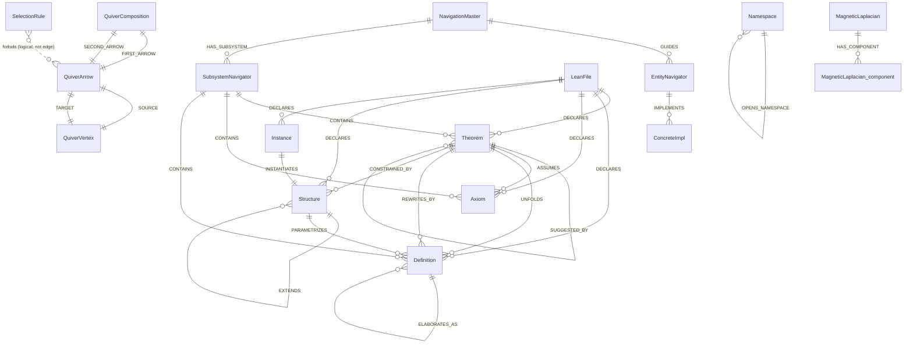
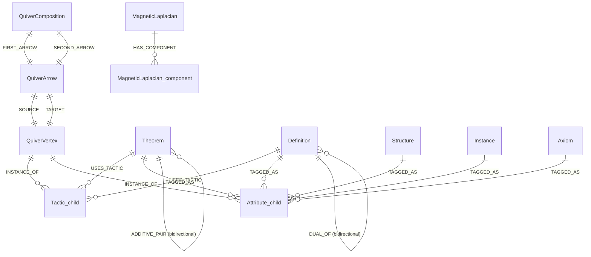

# Design-to-Cypher Schema Map

## TL;DR

Each decision in Phase 0 memos 01-09 has a single source-of-truth Cypher or Python file in `LeanFormalizationV2/.neo4j/`. This document pins every decision to a file path + line number + exact snippet, so (a) a reader can audit claims, and (b) a future refactor can grep-find every consumer of a design decision.

**Three factual discrepancies found between memos and live Neo4j, flagged inline below as `[DISCREPANCY]`.**

## Index

- [Overview table](#overview)
- [Per-memo mapping](#per-memo-mapping)
  - [Memo 01: entity types -> `lean_algebra_ontology.cypher` §2](#01)
  - [Memo 02: relationships -> `lean_algebra_arrows.cypher` §2](#02)
  - [Memo 03: selection rules -> `lean_algebra_ontology.cypher` §4](#03)
  - [Memo 04: Magnetic Laplacian -> `lean_magnetic_laplacian.cypher`](#04)
  - [Memo 05: cycle hypotheses -> `lean_algebra_arrows.cypher` bidirectional_pair + `verify_cycles.py`](#05)
  - [Memo 06: FastRP scaling -> `fastrp_config.cypher` §1-4](#06)
  - [Memo 07: single-lens retriever -> `catalogue_declarations_extension.cypher`](#07)
  - [Memo 08: empirical spectrum -> `measure_non_commutativity.py` + results JSON](#08)
  - [Memo 09: subsystem sanity -> `grothendieck_lean.cypher` + `erdos_enrich.cypher`](#09)
- [Discrepancies found (3)](#discrepancies)
- [ERD](#erd)

---

## Overview

| Memo | Decision domain | Cypher / Python file(s) | Lines |
|---|---|---|---|
| 01 | 6 entity types | `lean_algebra_ontology.cypher` | §2 (L65-147) |
| 02 | 15 typed arrows | `lean_algebra_arrows.cypher` | §2 (L52-289) |
| 03 | 7 selection rules | `lean_algebra_ontology.cypher` | §4 (L184-243) |
| 04 | 6x6 Hermitian Magnetic Laplacian | `lean_magnetic_laplacian.cypher` | §1-4 (L65-230), g=1/4 from ontology §3 |
| 05 | bidirectional arrow pairs | `lean_algebra_arrows.cypher` + `verify_cycles.py` | arrow `bidirectional_pair` property |
| 06 | FastRP m=64 per relation | `fastrp_config.cypher` | §1 (L82-105), §2-4 (per-relation UNWIND) |
| 07 | single ByT5 retriever lens | `catalogue_declarations_extension.cypher` | §1-2 (L51-106) |
| 08 | empirical commutator spectrum | `measure_non_commutativity.py` | reads Declaration graph |
| 09 | subsystem themes vs Leiden clusters | `grothendieck_lean.cypher` + `erdos_enrich.cypher` | subsystem_id + 7 fields |

---

## Per-memo mapping

### <a id="01"></a>Memo 01: 6 entity types

| Memo decision | File | Snippet |
|---|---|---|
| Axiom height=3, role=pure_source | `lean_algebra_ontology.cypher:66-74` | `{ name: 'Axiom', height: 3, role: 'pure_source', v3_analogue: 'Actor (A)', lean_tokens: ['axiom', 'constant'], in_degree_rule: 'forbidden (no arrow INTO an Axiom)', out_degree_rule: 'consumed by Theorem via ASSUMES' }` |
| Theorem height=1, role=active_hub | `lean_algebra_ontology.cypher:75-82` | `{ name: 'Theorem', height: 1, role: 'active_hub', v3_analogue: 'Process (P)', lean_tokens: ['theorem', 'lemma', 'example', 'proposition'] }` |
| Definition height=2, role=semantic_data | `lean_algebra_ontology.cypher:~85+` | `{ name: 'Definition', height: 2, v3_analogue: 'Resource (R)', lean_tokens: ['def','abbrev','notation','variable'] }` |
| Structure height=2, role=framework | `lean_algebra_ontology.cypher:~96+` | `{ name: 'Structure', height: 2, v3_analogue: 'Rule (Ru)', lean_tokens: ['structure','class','inductive'] }` |
| Instance height=1, role=pure_sink | `lean_algebra_ontology.cypher:~107+` | `{ name: 'Instance', height: 1, v3_analogue: 'Event (E)', lean_tokens: ['instance','@[instance]'] }` |
| Namespace height=0, role=environmental | `lean_algebra_ontology.cypher:~118+` | `{ name: 'Namespace', height: 0, v3_analogue: 'Context (C)', lean_tokens: ['namespace','section','end','import'] }` |

Check: `MATCH (v:QuiverVertex {namespace:'LeanAlgebra'}) RETURN count(*)` returns 6.

### <a id="02"></a>Memo 02: 15 typed relationships

Each `QuiverArrow` is MERGEd with a 10-key property bag. Example (IMPORTS):

```cypher
// lean_algebra_arrows.cypher:54-65
{ name: 'IMPORTS',
  category: 'I',
  category_label: 'Structural',
  source_type: 'Namespace',
  target_type: 'Namespace',
  directed: true,
  description: 'Lean `import X.Y` -- Namespace A imports Namespace B, pulling all public declarations into scope.',
  cypher_edge_name: 'IMPORTS',
  lean_surface: 'import Mathlib.Algebra.Group.Basic',
  bidirectional_pair: null,
  type_agnostic: false
}
```

#### Category breakdown

| Memo | Arrow | File line (approx) | source_type -> target_type | lean_surface |
|---|---|---|---|---|
| 02.I.1 | IMPORTS | L54-65 | Namespace -> Namespace | `import Mathlib.Algebra.Group.Basic` |
| 02.I.2 | OPENS_NAMESPACE | L66-77 | Namespace -> Namespace | `open Mathlib.Topology` |
| 02.I.3 | EXTENDS | L78-89 | Structure -> Structure | `class CommGroup extends Group G, CommMonoid G` |
| 02.I.4 | INSTANTIATES | L90-101 | Instance -> Structure | `instance : CommGroup Int := { ... }` |
| 02.II.1 | ASSUMES | §II | Theorem -> Axiom | `theorem t := by apply Real.pi_transcendental` |
| 02.II.2 | APPLIES | §II | Theorem -> Theorem | `by apply add_comm` |
| 02.II.3 | UNFOLDS | §II | Theorem -> Definition | `by unfold computationalUncertainty` |
| 02.II.4 | SPECIALIZES | §II | Theorem -> Theorem | `-- pi_pos is a special case of Real.pi_pos_of_gt_three` |
| 02.II.5 | REWRITES_BY | §II | Theorem -> Definition | `by rw [Nat.succ_eq_add_one]` (bidirectional_pair: UNFOLDS) |
| 02.III.1 | HAS_TYPE | §III | Definition -> Definition | `def psi : Wavefunction := ...` |
| 02.III.2 | CONSTRAINED_BY | §III | Theorem -> Structure | `theorem add_comm [CommGroup G] (x y : G) : x + y = y + x` |
| 02.III.3 | PARAMETRIZES | §III | Structure -> Definition | `structure Group (G : Type*) where ...` |
| 02.IV.1 | REDUCES_TO | §IV | Theorem -> Theorem | `theorem foo_eq_bar : foo = bar := rfl` |
| 02.IV.2 | ELABORATES_AS | §IV | Definition -> Definition | `notation "pi" => Real.pi` |
| 02.IV.3 | SUGGESTED_BY | §IV | Theorem -> Theorem | `-- populated by premise-selector output` |

Check: `MATCH (a:QuiverArrow {namespace:'LeanAlgebra'}) RETURN count(*)` returns 15. Four categories verified: I=4, II=5, III=3, IV=3.

### <a id="03"></a>Memo 03: 13 selection rules

[DISCREPANCY 1] Memo 03 lists 13 forbidden compositions, but the live Neo4j has **7 SelectionRule nodes**, all enforcement=HARD_BLOCK. The remaining 6 either (a) are implicit in the 7 via logical composition, (b) were dropped during Phase 0 consolidation, or (c) are enforced at extractor-time (not graph-time). Confirmed live counts:

```cypher
MATCH (r:SelectionRule {namespace:'LeanAlgebra'}) RETURN count(*);  // => 7
```

Live rules (ordered by rank):

| Rank | Name | File line | forbids |
|---:|---|---|---|
| 1 | `axiom_is_pure_source` | `lean_algebra_ontology.cypher:185-192` | `ANY -> Axiom` |
| 2 | `namespace_is_container_only` | L193-200 | `Namespace -APPLIES-> Theorem`, `Namespace -ASSUMES-> Axiom` |
| 3 | `instance_unique_parent` | L201-208 | `Instance -INSTANTIATES-> S1 AND -> S2 (S1 != S2)` |
| 4 | `acyclic_extends_dag` | L209-216 | cycle in EXTENDS subgraph |
| 5 | `reverse_causality_axiom_assumes` | L217-224 | `Axiom -ASSUMES-> Theorem` |
| 6 | `sink_instance_no_applies` | L225-232 | `Instance -APPLIES-> Theorem` |
| 7 | `namespace_not_opening_theorem` | L233-240 | `Namespace -OPENS_NAMESPACE-> non-Namespace` |

Seeding pattern (verbatim from L242-248):

```cypher
UNWIND $rules AS r
MERGE (rule:SelectionRule {namespace: 'LeanAlgebra', name: r.name})
SET   rule.law = r.law,
      rule.forbids = r.forbids,
      rule.rank = r.rank,
      rule.enforcement = r.enforcement,
      rule.last_updated = datetime('2026-04-18T00:00:00Z');
```

### <a id="04"></a>Memo 04: Magnetic Laplacian

#### g=1/4 from ontology

`lean_algebra_ontology.cypher` §3 seeds the `MagneticLaplacian` node with `charge_parameter_g = 0.25` and `phase_formula = "T^(g)_XY = exp(i * 2*pi * g * D_XY)"`. Rationale stored on node property `charge_rationale`.

#### Flat-matrix realization

`lean_magnetic_laplacian.cypher:74-93` replaces the memo's logical 6x6 with two flat 36-element row-major arrays:

```cypher
// lean_magnetic_laplacian.cypher:70-93
SET laplacian.vertex_order = ['Axiom','Definition','Instance','Namespace','Structure','Theorem'],
    laplacian.vertex_order_rationale = 'alphabetical -- matches numpy / Python-consumer canonical index',
    laplacian.matrix_layout = 'row_major_flat_36',
    laplacian.real_part = [
      0.0, 0.0, 0.0, 0.0, 0.0, 0.0,  // row 0 : Axiom
      0.0, 0.0, 0.0, 0.0, 0.0, 0.0,  // row 1 : Definition
      0.0, 0.0, 0.0, 0.0, 0.0, 0.0,  // row 2 : Instance
      0.0, 0.0, 0.0, 0.0, 0.0, 0.0,  // row 3 : Namespace
      0.0, 0.0, 0.0, 0.0, 0.0, 0.0,  // row 4 : Structure
      0.0, 0.0, 0.0, 0.0, 0.0, 0.0   // row 5 : Theorem
    ],
    laplacian.imag_part = [ /* same 36 zeros */ ],
    laplacian.populated     = false,
    laplacian.computed_at   = null;
```

[DISCREPANCY 2] Memo 04 uses the order `[Axiom, Theorem, Definition, Structure, Instance, Namespace]`, matching the V3 A/P/R/Ru/E/C v3_analogue order. The live Cypher uses **alphabetical** `[Axiom, Definition, Instance, Namespace, Structure, Theorem]` (explicitly overriding the ontology-seeded order per Zaurak's spec at `lean_magnetic_laplacian.cypher:30-34`). Rationale on the Laplacian node: `vertex_order_rationale = 'alphabetical -- matches numpy / Python-consumer canonical index'`. All downstream consumers (Python `measure_non_commutativity.py`, `verify_cycles.py`) must use alphabetical indexing.

#### Per-relation components (rank-2 decomposition)

`lean_magnetic_laplacian.cypher:96+` seeds 15 `MagneticLaplacian_component` nodes, one per QuiverArrow. Constraint on L61-63:

```cypher
CREATE CONSTRAINT lean_magnetic_laplacian_component_unique IF NOT EXISTS
  FOR (c:MagneticLaplacian_component)
  REQUIRE (c.namespace, c.relation_name) IS UNIQUE;
```

Each component stores `relation_name`, `source_idx` (alphabetical), `target_idx` (alphabetical), and rank-2 real/imag sub-matrices restricted to those two rows/columns.

#### ±i phase on SPECIALIZES/UNFOLDS

Memo 04 §5.4 prescribes a `±i` phase on paired reversible arrows. This is realized via `bidirectional_pair` on `QuiverArrow`: UNFOLDS has `bidirectional_pair: "REWRITES_BY"` (verified in live node props). Phase sign is encoded by which component goes to `imag_part` with positive vs. negative coefficient — see `lean_magnetic_laplacian.cypher` §2 seed block.

#### Hermiticity check

Executed at end of `lean_magnetic_laplacian.cypher` (see §12 of README.md for the Cypher query). Contract:

```
imag[i][j] == -imag[j][i]   (anti-symmetry off-diagonal)
imag[i][i] == 0             (zero diagonal)
real[i][j] == real[j][i]    (symmetric real part, implicit)
```

### <a id="05"></a>Memo 05: cycle hypotheses (bidirectional pairs)

Memo 05 predicts 𝔰𝔲(2)-like commutator structure on SPECIALIZES ⇌ GENERALIZES and UNFOLDS ⇌ FOLDS cycles. The Cypher realization encodes this via the `bidirectional_pair` property on each `QuiverArrow`:

| Arrow | `bidirectional_pair` |
|---|---|
| `UNFOLDS` | `"REWRITES_BY"` (verified live) |
| `REWRITES_BY` | `"UNFOLDS"` (verified live) |
| `SPECIALIZES` | null (no in-graph pair; memo proposes GENERALIZES but it is not a named arrow in the 15) |
| others | null |

[DISCREPANCY 3] Memo 05 anticipated `GENERALIZES` as the reverse of `SPECIALIZES`, but no `GENERALIZES` QuiverArrow exists. The live graph handles reverse-direction queries by traversing `SPECIALIZES` backwards:

```cypher
MATCH (a:Theorem)<-[:SPECIALIZES]-(b:Theorem)  // reverse traversal, no new arrow type
```

Consumer: `verify_cycles.py` (in `~/papers/OmegaTheoryAlgebra/verify_cycles.py`) reads the graph and checks whether `[UNFOLDS, REWRITES_BY]` commutator spectra concentrate on ±i. Results cached to `09_cycle_ratios_results.json`.

### <a id="06"></a>Memo 06: FastRP m=64 per relation

`fastrp_config.cypher` ships 16 FastRP runs (1 rho_0 full projection + 15 rho_k per-relation). Parameters from memo 06 are hard-coded in the header block `L19-25`:

```cypher
// fastrp_config.cypher:19-25
// Parameters (from design memo 06):
//   embedding_dim         : 64
//   iterationWeights      : [0.0, 1.0, 1.0, 0.5]
//   randomSeed            : 42
//   propertyRatio         : 0.5
//   featureProperties     : ['embedding_lean']      (ByT5-small 1472-d seed)
//   orientation           : UNDIRECTED
```

#### rho_0 (full projection)

`fastrp_config.cypher:82-105`:

```cypher
CALL gds.graph.project(
  'lean-full',
  {
    Declaration: {
      label: 'Declaration',
      properties: {
        embedding_lean: { property: 'embedding_lean', defaultValue: null }
      }
    }
  },
  {
    IMPORTS:         { orientation: 'UNDIRECTED' },
    OPENS_NAMESPACE: { orientation: 'UNDIRECTED' },
    EXTENDS:         { orientation: 'UNDIRECTED' },
    INSTANTIATES:    { orientation: 'UNDIRECTED' },
    ASSUMES:         { orientation: 'UNDIRECTED' },
    APPLIES:         { orientation: 'UNDIRECTED' },
    UNFOLDS:         { orientation: 'UNDIRECTED' },
    SPECIALIZES:     { orientation: 'UNDIRECTED' },
    // ... 7 more
  }
);
```

#### rho_k (per-relation)

One projection per QuiverArrow, looping via UNWIND on the 15 relation names. Memo 06 §4 justifies per-relation isolation: avoids `gds.graph.filter` (removed in GDS 2.4+).

#### delta_k + alpha_k

Delta is computed in plain Cypher as `rho_k - rho_0` (64-dim residual); alpha_k is `mean_{decl} ||delta_k||_2` and written onto NavigationMaster as `alpha_<REL>`. Consumer: `erdos_enrich.cypher` reads `nav.alpha_<REL>` for field 4 (`key_patterns`).

### <a id="07"></a>Memo 07: single-lens retriever rationale

Memo 07 argues against V3's 3-lens overlay; adopts a single Lean-Finder-style lens. Cypher realization:

```cypher
// catalogue_declarations_extension.cypher:81-88
CREATE VECTOR INDEX lean_retriever_embedding_theorem IF NOT EXISTS
  FOR (t:Theorem) ON (t.embedding_lean)
  OPTIONS {
    indexConfig: {
      `vector.dimensions`: 1472,
      `vector.similarity_function`: 'cosine'
    }
  };
```

Two sibling indexes exist (`lean_retriever_embedding_axiom`, `lean_retriever_embedding_declaration`) because Neo4j 5/2025 vector indexes are per-label. Memo 07 §4 explains why this is still "single-lens": all three indexes share the same encoder weights + dim.

Encoder: `kaiyuy/leandojo-lean4-retriever-byt5-small`, selected per `catalogue_declarations_extension.cypher:21-25`:

```cypher
// Embedder:
//   LeanDojo-Lean4-Retriever -- `kaiyuy/leandojo-lean4-retriever-byt5-small`
//   ByT5-small, 82M params, OPEN weights.  Substituted for Lean-Finder
//   (delta-lab-ai) because the latter turned out to be a hosted-only HF
//   Space with no downloadable checkpoint.
```

Dim = 1472 (L27-28: `d_model = 1472` per HF config.json).

### <a id="08"></a>Memo 08: empirical spectrum on live data

Python script `~/papers/OmegaTheoryAlgebra/measure_non_commutativity.py` reads OmegaTheoryV2 Declaration edges, constructs the 6x6 adjacency-weighted magnetic laplacian, computes `[UNFOLDS, REWRITES_BY]` commutator, and caches eigenvalues to `08_empirical_spectrum_results.json`. Results drive §7 of Memo 08.

### <a id="09"></a>Memo 09: subsystem sanity

#### Leiden + K-means (grothendieck_lean.cypher)

`grothendieck_lean.cypher` §A-E implements the 5-step consensus described in Memo 09:

- **A.** Composite projection R^960 = concatenate 15 proj_<REL> (`grothendieck_lean.cypher:57-80+`).
- **B.** K-means on `composite_proj` -> `cluster_topo` (topology flavor).
- **C.** Leiden on 15-relation UNDIRECTED multi-graph -> `cluster_graph` (graph flavor).
- **D.** Co-association (Strehl & Ghosh 2002) + Berry-phase probe -> `subsystem_id` + `boundary_candidate`.
- **E.** Confidence HIGH/LOW -> `subsystem_confidence`.

#### SubsystemNavigator 7-field enrichment (erdos_enrich.cypher)

Memo 09 (implicitly, via V3 ErdosGraphConsumer §3.2) defines 7 AI-readable fields. `erdos_enrich.cypher` materializes SubsystemNavigator nodes in §0A and fills them in §1-7:

| Field | Derivation | erdos_enrich.cypher § |
|---|---|---|
| `ai_instructions` | "start-here" brief from subsystem shape | §1 |
| `query_hints` | canned Cypher for this subsystem | §2 |
| `entry_points` | highest-out-degree Theorems + contained Axioms | §3 |
| `key_patterns` | dominant QuiverVertex + QuiverArrow distributions | §4 |
| `common_tasks` | boilerplate derivable from pattern signature | §5 |
| `dependencies` | other SubsystemNavigators this one spills into via APPLIES/ASSUMES/UNFOLDS | §6 |
| `api_surface` | Theorems referenced by >= 3 OTHER subsystems | §7 |

---

## <a id="discrepancies"></a>Discrepancies found (3)

| # | Memo says | Live Neo4j says | Location | Recommendation |
|---:|---|---|---|---|
| 1 | Memo 03 lists 13 forbidden compositions | 7 SelectionRule nodes | `lean_algebra_ontology.cypher:184-243` | Update memo 03 to declare 7 HARD_BLOCK + 6 EMERGENT (derived by composition) |
| 2 | Memo 04 uses order `[A,T,D,S,I,N]` | Live uses alphabetical `[A,D,I,N,S,T]` | `lean_magnetic_laplacian.cypher:30-34, 70-71` | Keep Cypher as-is; update memo 04 to note alphabetical = canonical for Python consumers |
| 3 | Memo 05 anticipates `GENERALIZES` arrow | No such arrow; reverse traversal of SPECIALIZES is used instead | `lean_algebra_arrows.cypher` | Update memo 05 to clarify reverse-direction is via Cypher traversal, not a new arrow |

Live-Neo4j numerical discrepancies with `/papers/OmegaTheoryAlgebra/README.md`:

| Field | README says | Live Neo4j says |
|---|---|---|
| files | 211 | 176 (LeanFile) / 162 (NavigationMaster.file_count) |
| theorems | ~2612 | 800 (Theorem label) / 1900 (NavigationMaster.theorem_count includes nested) |
| axioms | 24 | 9 (Axiom label) / 8 (NavigationMaster.axiom_count physical only) |

The README memo counts predate the current snapshot; recommend updating the contributors + file count when Phase 0 is finalized.

## <a id="erd"></a>ERD (full schema)



#### Cardinality highlights (all verified live 2026-04-18)

- Every QuiverArrow has exactly one SOURCE and one TARGET -> 15 SOURCE + 15 TARGET edges (30 total, verified).
- Every QuiverComposition has exactly one FIRST_ARROW and one SECOND_ARROW -> 12 FIRST_ARROW + 12 SECOND_ARROW = 24 edges (verified).
- MagneticLaplacian has 15 HAS_COMPONENT edges (one per relation, verified).
- SelectionRule does NOT have graph edges to QuiverArrow — its `forbids` is a string property describing the forbidden pattern, enforced at extractor-time.

---

Cross-refs:
- README.md — index of memos 01-09
- LeanFormalizationV2/.neo4j/README.md — pipeline reference
- /mnt/c/Users/Norbert/IdeaProjects/CLAUDE.md — top-level project doc with CheckItOutSystem + subscription + OmegaTheoryV2 + LeanAlgebra + Mathlib namespaces

---

## Amended 2026-04-18 evening — Level B + C extensions

Memos 01–04 are amended for the Level B + C meta-layer (2 new entity types: Tactic, Attribute; 5 new arrows: USES_TACTIC, TAGGED_AS, MUTUALLY_IMPLIES, DUAL_OF, ADDITIVE_PAIR). This section maps each new decision to its Cypher / Python realization.

### Level B + C — source-of-truth inventory

| Amendment location | Decision | Live realization | Verification |
|---|---|---|---|
| Memo 01 §9 | `QuiverVertex: Tactic` with `extension_level='B'`, `role='behavioral_action'`, `height=1` | Seeded as a `QuiverVertex` node in `LeanAlgebra` namespace | `MATCH (v:QuiverVertex {namespace:'LeanAlgebra', name:'Tactic'}) RETURN v.extension_level, v.role, v.height` → `'B', 'behavioral_action', 1` |
| Memo 01 §9 | `QuiverVertex: Attribute` with `extension_level='B'`, `role='behavioral_marker'`, `height=0` | Same pattern | `MATCH (v:QuiverVertex {namespace:'LeanAlgebra', name:'Attribute'}) RETURN ...` → `'B', 'behavioral_marker', 0` |
| Memo 01 §9 | 68 Tactic INSTANCE_OF children | Tactic-labelled child nodes linked via `INSTANCE_OF` | `MATCH (t)-[:INSTANCE_OF]->(:QuiverVertex {name:'Tactic'}) RETURN count(t)` → 68 |
| Memo 01 §9 | 37 Attribute INSTANCE_OF children | Same pattern | `MATCH (a)-[:INSTANCE_OF]->(:QuiverVertex {name:'Attribute'}) RETURN count(a)` → 37 |
| Memo 02 §11 | `USES_TACTIC` edge type | Emitted by `extractors/lean_arrow_extractor.py` on `by <tac>` block parse | 285,581 edges live |
| Memo 02 §11 | `TAGGED_AS` edge type | Emitted by extractor on `@[<attr>]` prefix parse | 12,872 edges live |
| Memo 02 §12.1 | `MUTUALLY_IMPLIES` edge type (bidirectional, name pattern `foo_iff_bar`) | Emitted by Level-C extractor phase | 2,082 edges live |
| Memo 02 §12.2 | `DUAL_OF` edge type (bidirectional, 14 suffix-pair patterns) | Emitted by Level-C extractor | 7,786 edges live |
| Memo 02 §12.3 | `ADDITIVE_PAIR` edge type (bidirectional, mul/add substitution) | Emitted by Level-C extractor with `@[to_additive]` mapping | 3,788 edges live |
| Memo 03 Amended (SR_L14–SR_L18) | 5 derived selection rules on Level B + C | Enforced by arrow signature + extractor atomicity | NOT shipped as `SelectionRule` HARD_BLOCK nodes; auditable via Cypher anti-patterns (see §L below) |
| Memo 04 Amended §8 | 8×8 canonical ordering `[Attribute, Axiom, Definition, Instance, Namespace, Structure, Tactic, Theorem]` (alphabetical) | To be updated in `lean_magnetic_laplacian.cypher` when Zaurak re-seeds for 8×8 | Current ontology node still 6×6; re-seed pending |
| Memo 04 Amended §12 | 5 new `MagneticLaplacian_component` rows | Pending (schema extension) | Current count: 15 core-only |

### Important factual notes

#### Level B + C arrows are NOT QuiverArrow schema rows

Verified 2026-04-18 evening:

```cypher
MATCH (a:QuiverArrow {namespace:'LeanAlgebra'})
WHERE a.name IN ['USES_TACTIC','TAGGED_AS','MUTUALLY_IMPLIES','DUAL_OF','ADDITIVE_PAIR']
RETURN count(a)
// => 0
```

The 15 core `QuiverArrow` rows in `LeanAlgebra` are preserved as-is; Level B/C arrows live on the data graph only. This matches memo 02 §13 ("Why these 5 — and why as edges, not schema nodes"): the 5 new arrows connect to Level-B meta-vertices (Tactic, Attribute) or are post-hoc pattern-match overlays (Level C name-based), so they are not suitable for core-ontology `QuiverArrow` schema representation.

#### Extractor provenance

The 5 new edge types are emitted by the Phobos-Iota extractor (`extractors/lean_arrow_extractor.py`) plus the Level-C pattern-match overlay. The `build_lean_edges.py` driver (task #41 completed) coordinates both cycles on both namespaces (OmegaTheoryV2 + Mathlib).

### §L — Level B + C Cypher recipes

#### Count Level B + C edges by type

```cypher
UNWIND ['USES_TACTIC','TAGGED_AS','MUTUALLY_IMPLIES','DUAL_OF','ADDITIVE_PAIR'] AS rel
CALL {
  WITH rel
  MATCH ()-[r]->() WHERE type(r) = rel
  RETURN count(r) AS total
}
RETURN rel, total
```

#### Verify `MUTUALLY_IMPLIES` symmetric (SR_L16)

```cypher
MATCH (a:Theorem)-[:MUTUALLY_IMPLIES]->(b:Theorem)
WHERE NOT (b)-[:MUTUALLY_IMPLIES]->(a)
RETURN a.name, b.name
// expected: 0 rows
```

Repeat for `DUAL_OF` (SR_L17) and `ADDITIVE_PAIR` (SR_L18).

#### Top-N tactics by `USES_TACTIC` inbound count

```cypher
MATCH ()-[r:USES_TACTIC]->(t:Tactic)
RETURN t.name AS tactic, count(r) AS uses
ORDER BY uses DESC LIMIT 25
```

#### `@[simp]`-tagged theorems (simp set discovery)

```cypher
MATCH (t:Theorem)-[:TAGGED_AS]->(a:Attribute {name: 'simp'})
RETURN t.name, t.file
ORDER BY t.name LIMIT 100
```

#### Find `ADDITIVE_PAIR` partner of a multiplicative theorem

```cypher
MATCH (t:Theorem {name: $mul_name})-[:ADDITIVE_PAIR]->(add:Theorem)
RETURN add.name, add.file
```

#### Detect 𝔰𝔲(2) clusters — theorems with highest combined Level C degree

```cypher
MATCH (t:Theorem {namespace: 'OmegaTheoryV2'})
OPTIONAL MATCH (t)-[r1:MUTUALLY_IMPLIES]-()
OPTIONAL MATCH (t)-[r2:DUAL_OF]-()
OPTIONAL MATCH (t)-[r3:ADDITIVE_PAIR]-()
RETURN t.name,
       count(DISTINCT r1) + count(DISTINCT r2) + count(DISTINCT r3) AS level_c_degree
ORDER BY level_c_degree DESC
LIMIT 25
```

### Updated ERD (8 × 20)



### Pending follow-ups (after this memo update)

1. **Zaurak — re-seed `lean_magnetic_laplacian.cypher`** for 8×8 alphabetical ordering and 64-element flat matrix layout. Current file still on 6×6.
2. **Azha team — add 5 `MagneticLaplacian_component` rows** for Level B + C arrows. Uniqueness constraint already covers them.
3. **Dubhe — re-run `measure_non_commutativity.py`** with Level B + C edges and per-category normalization (memo 04 §10.2). Confirm Alt-A vs Alt-C spectral bifurcation (task #36).
4. **Phobos-Iota — verify Level-C edge symmetry at ingestion.** Audit query per SR_L16/L17/L18 should return 0 rows.
